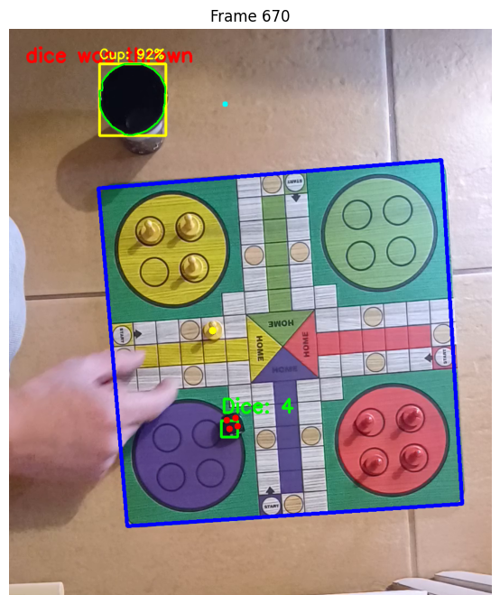

# Board Game Detection System
## "Man, Don't Get Mad!" Computer Vision Project

Real-time detection and tracking system for gameplay elements using OpenCV. Detects board position, pawns, dice, and cup across varying recording conditions without neural networks.

## Project Overview

Computer vision pipeline for "Man, Don't Get Mad!" (Mensch ärgere Dich nicht) - a race-style board game where 2-4 players move pieces from start to finish via dice rolls.

**Academic Assignment**: Computer vision coursework implementing board game state recognition from video clips.

## Key Features

- **Board tracking** via ORB feature homography
- **4-color pawn detection** (red, yellow, green, blue)
- **Dice reading** with automatic dot counting
- **Cup tracking** using Kalman filtering
- **Event detection** for dice throws
- **Dual processing modes**: live preview & batch export

## Dataset

9 videos across 3 difficulty levels (3 videos each):

- **Easy**: Ideal lighting, steady camera, top-down view
- **Medium**: Changing shadows, steady camera, top-down view
- **Hard**: Changing shadows, camera shake, camera angles

## Detection Pipeline

**6-Stage Processing:**

1. **Board Mask**: HSV segmentation → morphological cleaning → convex hull
2. **Homography**: ORB features (6000 keypoints) → RANSAC alignment → temporal consistency
3. **Board Overlay**: Blue boundary via perspective transformation
4. **Pawns**: Color sampling at 52 fixed board positions (HSV thresholds)
5. **Dice**: White dot detection → clustering → number recognition
6. **Cup**: Black object segmentation → shape filtering → Kalman tracking

## Usage

```python
process_single_frame("easy1", frame_number=300, show=True, save=True)

process_video("easy1", show=True)

process_video("easy1", show=True, duration_sec=30)
```

**Visual Output**: Blue board boundary • Colored pawn dots • Green dice box • Yellow cup box • Cyan tracking dot • Red event notifications

## Visual Demonstrations
Sample frame from medium difficulty:



Sample from the hard difficulty:


## Built with
[wbochenski](https://github.com/wbochenski)

